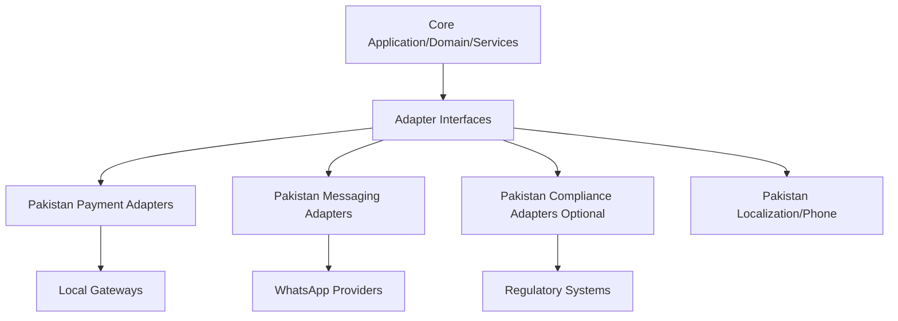
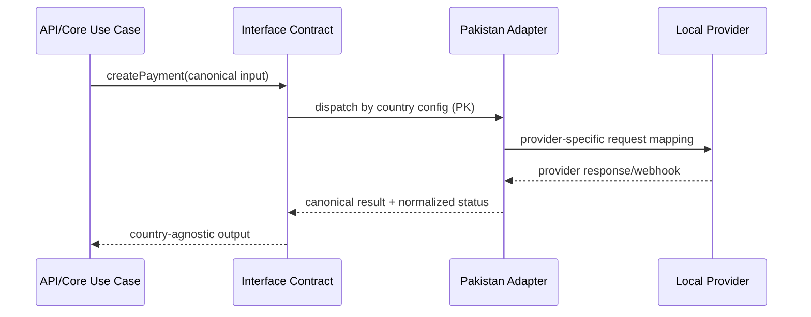

# Pakistan Adapter Architecture (Strict Country Isolation)

## 1) Architecture Principle (Non-Negotiable)

1. **Core is country-agnostic**: `core/*`, `services/*`, and domain models contain no country/provider-specific conditions.
2. **Country logic is adapter-only**: Pakistan behavior exists only in `adapters/pakistan/*`.
3. **Integration access is contract-driven**: core depends on interfaces in `adapters/interfaces/*` only.
4. **No reverse dependency**: adapters import core contracts/types but core never imports country adapter implementations.

---

## 2) Layer Design

```text
core/
  application/
  domain/
  services/
adapters/
  interfaces/
    payment_adapter.ts
    messaging_adapter.ts
    compliance_adapter.ts
    types.ts
  pakistan/
    payment/
      easypaisa_adapter.ts
      jazzcash_adapter.ts
    messaging/
      whatsapp_360dialog_adapter.ts
      whatsapp_gupshup_adapter.ts
    localization/
      pakistan_phone_formatter.ts
      pakistan_locale_adapter.ts
    compliance/
      pta_compliance_adapter.ts        # optional
      fbr_tax_hook_adapter.ts          # optional
    bootstrap/
      pakistan_adapter_registry.ts
```

### Ownership Boundaries

- `core/*`: use-cases, orchestration, domain invariants, global policies.
- `adapters/interfaces/*`: stable contracts, shared DTOs, error taxonomy.
- `adapters/pakistan/*`: provider-specific APIs, payload mapping, local validation, localization, optional compliance hooks.

---

## 3) Pakistan Adapter Responsibilities

### A) WhatsApp Providers
- Implement WhatsApp send/status capabilities via provider clients (e.g., 360dialog, Gupshup).
- Map provider webhooks into canonical message status model.
- Hide provider-specific auth, retries, and throttling.

### B) Local Payment Gateways
- Implement payment create/capture/refund/status for local gateways (e.g., Easypaisa, JazzCash).
- Normalize payment states to canonical status enum.
- Convert provider errors into standard adapter failures.

### C) Phone Formatting
- Enforce Pakistan dialing rules using canonical storage + outbound formatting.
- Canonical format in core remains E.164; adapter handles local input normalization.

### D) Localization
- Currency: PKR formatting and minor-unit rules.
- Date/time rendering/parsing for Pakistan locale requirements.
- Must be presentation/adapter-facing only; no domain rule branching by country.

### E) Bilingual Support (EN/UR)

Pakistan market requires bilingual capability — English as default, Urdu as optional secondary.

**Scope:**
- WhatsApp message templates: English and Urdu variants stored per template key.
- Collection reminder messages: polite/firm/urgent tone variants in both languages.
- System notifications to agents/owners: English only (agent-facing UI is English).
- Customer-facing outbound messages: locale determined by customer preference or tenant default.

**`LocaleAdapter` extension:**

```python
class LocaleAdapter(Protocol):
    def format_money(self, amount_minor: int, currency: str) -> str: ...
    def format_date(self, iso_date: str) -> str: ...
    def currency_minor_units(self, currency: str) -> int: ...
    def get_string(self, key: str, locale: str = "en") -> str: ...
    # locale: "en" (default) or "ur" (Urdu)
```

`get_string` returns a locale-aware string for a given key. Keys are defined in a flat dictionary per adapter. Urdu strings use Unicode (UTF-8, RTL-aware). If a key has no Urdu translation, falls back to English — never raises an error.

**RTL rendering:** UI components must support `dir="rtl"` when rendering Urdu text. This is enforced at the template layer; backend sends locale tag alongside message text.

### F) Pakistan Communication Tone Guidelines

All system-generated outbound messages (reminders, follow-ups, notifications) must follow Pakistan cultural communication norms:

| Tone Tier | Context | Guidelines |
|---|---|---|
| `polite` | Pre-due reminders, first contact | Use "Respected [Name]" or "Dear [Name]". Assume payment will arrive. Frame as courtesy reminder. |
| `firm` | 1-7 days overdue | Reference the amount directly. Use "kindly" and "please". Avoid accusatory language. |
| `urgent` | 8+ days overdue | State the situation clearly. Mention next escalation step. Remain professional — no threatening tone. |

**Language note:** Urdu tone conventions differ from English. When sending Urdu messages, tone tier maps to culturally appropriate Urdu phrasing — not word-for-word translation of the English template. Urdu template variants must be reviewed by a native speaker before production deployment.

### E) Compliance Hooks (Optional, Isolated)
- Optional module for country-specific checks/filings (e.g., telecom/tax-related processes).
- Triggered via interface hooks; disabled by configuration if not required.
- Compliance failures are isolated and do not mutate core domain rules.

---

## 4) Interface Contracts

> Contracts below are defined in `adapters/interfaces/*` and consumed by core services.

### 4.1 `PaymentAdapter`

```ts
interface PaymentAdapter {
  createPayment(input: PaymentCreateInput, ctx: AdapterContext): Promise<PaymentCreateResult>;
  capturePayment(input: PaymentCaptureInput, ctx: AdapterContext): Promise<PaymentCaptureResult>;
  refundPayment(input: PaymentRefundInput, ctx: AdapterContext): Promise<PaymentRefundResult>;
  getPaymentStatus(input: PaymentStatusInput, ctx: AdapterContext): Promise<PaymentStatusResult>;
  parseWebhook(input: RawWebhookInput, ctx: AdapterContext): Promise<PaymentWebhookEvent>;
}
```

**Input schema (canonical):**
- `PaymentCreateInput`: `idempotencyKey`, `orderId`, `customerId`, `amountMinor:int`, `currency:string`, `callbackUrl?`, `metadata?`.
- `PaymentCaptureInput`: `paymentRef`, `amountMinor?`, `reason?`.
- `PaymentRefundInput`: `paymentRef`, `refundRef`, `amountMinor`, `reason`.
- `PaymentStatusInput`: `paymentRef`.

**Output schema (canonical):**
- `PaymentCreateResult`: `paymentRef`, `status`, `providerTxnId?`, `nextActionUrl?`, `raw?`.
- `PaymentCaptureResult` / `PaymentRefundResult`: `paymentRef`, `status`, `providerTxnId?`, `raw?`.
- `PaymentStatusResult`: `paymentRef`, `status`, `lastUpdatedAt`, `raw?`.
- `PaymentWebhookEvent`: `eventId`, `eventType`, `paymentRef`, `status`, `occurredAt`, `raw`.

**Failure handling:**
- Throw `AdapterError` with taxonomy:
  - `VALIDATION_ERROR` (non-retryable)
  - `AUTH_ERROR` (non-retryable until credential rotate)
  - `RATE_LIMITED` (retryable with backoff)
  - `PROVIDER_UNAVAILABLE` (retryable)
  - `CONFLICT_IDEMPOTENCY` (safe read-after-write)
  - `UNKNOWN_PROVIDER_ERROR` (retryable with cap)
- Include fields: `code`, `message`, `retryable`, `provider`, `providerCode?`, `correlationId`.

### 4.2 `MessagingAdapter`

```ts
interface MessagingAdapter {
  sendMessage(input: MessageSendInput, ctx: AdapterContext): Promise<MessageSendResult>;
  sendTemplate(input: TemplateSendInput, ctx: AdapterContext): Promise<MessageSendResult>;
  getMessageStatus(input: MessageStatusInput, ctx: AdapterContext): Promise<MessageStatusResult>;
  parseWebhook(input: RawWebhookInput, ctx: AdapterContext): Promise<MessageWebhookEvent[]>;
}
```

**Input schema:**
- `MessageSendInput`: `messageId`, `to`, `channel`, `body`, `mediaUrls?`, `metadata?`.
- `TemplateSendInput`: `messageId`, `to`, `templateId`, `params`, `locale`, `metadata?`.
- `MessageStatusInput`: `providerMessageId`.

**Output schema:**
- `MessageSendResult`: `messageId`, `providerMessageId`, `status`, `acceptedAt`, `raw?`.
- `MessageStatusResult`: `providerMessageId`, `status`, `lastUpdatedAt`, `raw?`.
- `MessageWebhookEvent`: `eventId`, `providerMessageId`, `status`, `occurredAt`, `reason?`, `raw`.

**Failure handling:**
- Same `AdapterError` taxonomy as payment.
- Additional non-retryable: `TEMPLATE_REJECTED`, `INVALID_RECIPIENT`.

### 4.3 `ComplianceAdapter`

```ts
interface ComplianceAdapter {
  preActionCheck(input: ComplianceCheckInput, ctx: AdapterContext): Promise<ComplianceCheckResult>;
  postActionReport(input: ComplianceReportInput, ctx: AdapterContext): Promise<ComplianceReportResult>;
}
```

**Input schema:**
- `ComplianceCheckInput`: `actionType`, `entityId`, `country`, `payload`, `occurredAt`.
- `ComplianceReportInput`: `actionType`, `entityId`, `country`, `payload`, `occurredAt`, `traceId`.

**Output schema:**
- `ComplianceCheckResult`: `allowed:boolean`, `reasonCode?`, `obligations?:string[]`.
- `ComplianceReportResult`: `accepted:boolean`, `reportRef?`, `submittedAt?`, `raw?`.

**Failure handling:**
- `CHECK_BLOCKED` returns `allowed=false` (business block, not system failure).
- System/provider failures return `AdapterError`.
- Compliance adapter is feature-flagged; when disabled, `NoopComplianceAdapter` returns pass-through results.

---

## 5) Dependency Rule (Enforced)

### Allowed dependencies
- `core/*` → `adapters/interfaces/*`
- `adapters/pakistan/*` → `adapters/interfaces/*`, provider SDKs, shared infra libs

### Forbidden dependencies
- `core/*` → `adapters/pakistan/*`
- `domain/*` containing provider/country enums
- Any adapter importing another country adapter

### Enforcement controls
- Static import lint rules (denylist patterns).
- Architecture test: fail CI if core imports `adapters/pakistan`.
- Config-only country selection at bootstrap (`COUNTRY=PK`).

---

## 6) Extensibility Design

### 6.1 Adding a New Country (UAE, KSA, etc.)

1. Create new package `adapters/<country_code>/` mirroring the Pakistan structure (payment/, messaging/, localization/, compliance/, bootstrap/).
2. Implement `PaymentAdapter`, `MessagingAdapter`, `ComplianceAdapter`, `PhoneFormatter`, and `LocaleAdapter` for the new country's providers.
3. Register in adapter registry (see Plug-and-Play Registry below) without changing any core use-case code.
4. Select adapter set via tenant/country configuration (`COUNTRY=UAE`, etc.).
5. Run the shared contract test suite against the new country adapters to verify interface compliance.
6. Add integration contracts for new providers to [`integration-contracts.md`](integration-contracts.md).

### 6.2 Adding a New Messaging Provider (Within an Existing Country)

To add a new WhatsApp or messaging provider for an existing country:

1. Create a new adapter file in `adapters/<country>/messaging/<provider>_adapter.ts`.
2. Implement the `MessagingAdapter` interface (all 4 methods: `sendMessage`, `sendTemplate`, `getMessageStatus`, `parseWebhook`).
3. Use the shared `AdapterError` taxonomy — do not introduce new error types.
4. Register the provider in the country's `bootstrap/<country>_adapter_registry.ts` with a provider key.
5. Add provider selection config: `MESSAGING_PROVIDER=<provider_key>` (tenant-level or global).
6. Add the provider's webhook endpoint and contract to [`integration-contracts.md`](integration-contracts.md).
7. Run the `MessagingAdapter` contract test suite against the new provider.

No core code changes are required. No existing providers are affected.

### 6.3 Adding a New Payment Provider (Within an Existing Country)

To add a new payment gateway for an existing country:

1. Create a new adapter file in `adapters/<country>/payment/<provider>_adapter.ts`.
2. Implement the `PaymentAdapter` interface (all 5 methods: `createPayment`, `capturePayment`, `refundPayment`, `getPaymentStatus`, `parseWebhook`).
3. Map provider-specific payment states to the canonical status enum (`INITIATED`, `AUTHORIZED`, `CAPTURED`, `SETTLED`, `FAILED`, `REFUNDED`).
4. Use `AdapterError` taxonomy for all failure types — include `retryable` flag.
5. Register in `bootstrap/<country>_adapter_registry.ts`.
6. Add provider selection config: `PAYMENT_PROVIDER=<provider_key>`.
7. Add the provider's webhook contract to [`integration-contracts.md`](integration-contracts.md).
8. Run the `PaymentAdapter` contract test suite against the new provider.

### Plug-and-Play Registry

```ts
interface CountryAdapterBundle {
  payment: PaymentAdapter;
  messaging: MessagingAdapter;
  compliance: ComplianceAdapter;
  phone: PhoneFormatter;
  locale: LocaleAdapter;
}

function resolveAdapters(countryCode: string): CountryAdapterBundle;
```

No core code changes required when replacing Pakistan providers or adding new countries.

---

## 7) Diagrams

### 7.1 Layer Diagram



### 7.2 Request Flow



---

## 8) Implementation Checklist

- [ ] Create `adapters/interfaces/*` contracts + DTOs + `AdapterError`.
- [ ] Build `adapters/pakistan/payment/*` implementations.
- [ ] Build `adapters/pakistan/messaging/*` implementations.
- [ ] Add phone/localization adapters for PK.
- [ ] Add optional compliance adapters + no-op fallback.
- [ ] Add adapter registry and config-based resolver.
- [ ] Add contract tests shared across countries.
- [ ] Add import-boundary architecture test in CI.

---

## 9) Review Agent QC (Target: 10/10)

### Checks performed

1. **No country leakage into core**: core constrained to interface contracts only.
2. **Adapter isolation**: Pakistan concerns fully scoped to `adapters/pakistan/*`.
3. **Missing flows**: included outbound requests + inbound webhook normalization for payment/messaging.
4. **Extensibility**: explicit country bundle and resolver for UAE/KSA expansion.

### Gap report

- Initial potential gap: compliance could block core flows unpredictably.
- **Fix applied**: defined explicit behavior (`CHECK_BLOCKED` as business result; system errors as adapter errors) and feature-flagged no-op fallback.

### Extra work identified

- Add CI architecture test and contract-test matrix per country adapter.
- Add operational runbooks for provider credential rotation and incident fallback.

### Alignment score

- **10/10** after fixes.
