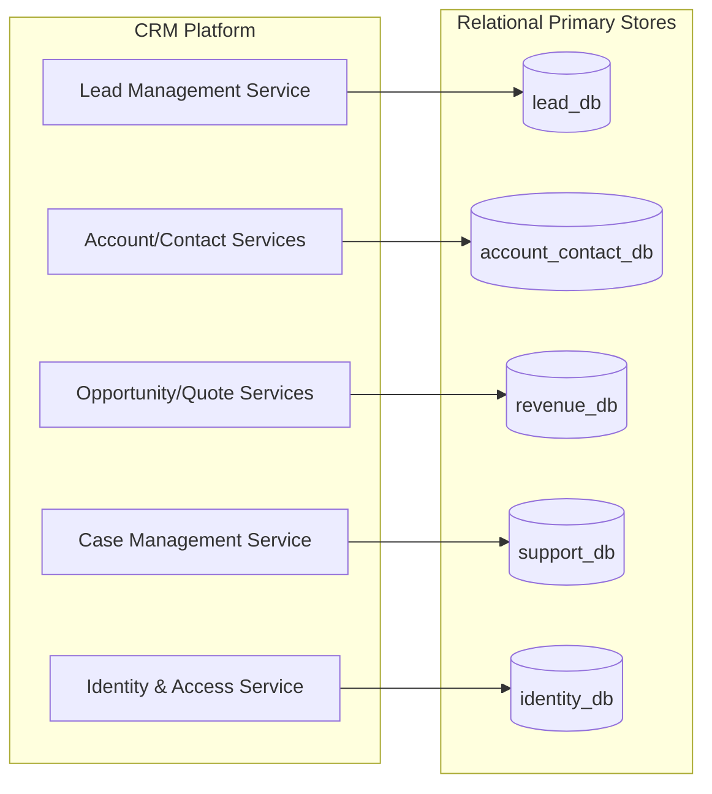
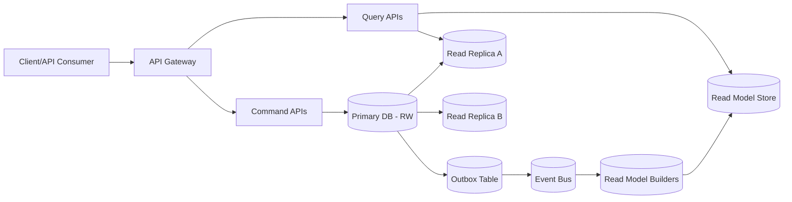
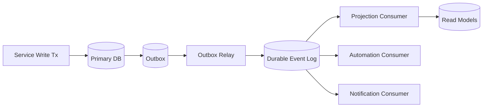
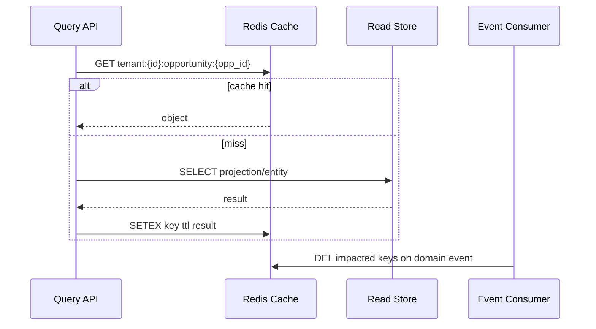

# Data Architecture

## Goals and Constraints

- Align physical storage with the CRM domain model and service ownership defined in `docs/domain-model.md`.
- Scale to high tenant counts and uneven tenant traffic while preserving strict tenant isolation.
- Support low-latency OLTP writes, high-throughput reads, and reliable event-driven integrations.
- Keep architecture evolvable (schema versioning, online migrations, independent service scaling).

---

## 1) DB Schema Strategy

### 1.1 Strategy Summary

Use a **domain-owned, tenant-scoped, relational primary store** per service boundary:

- **Storage model:** Postgres-compatible relational databases.
- **Ownership model:** Each service owns its write schema (no cross-service writes).
- **Tenant model:** Shared database with **row-level tenant partitioning** by `tenant_id` and optional sharding for high-scale tiers.
- **Consistency model:** ACID inside a service boundary; cross-service consistency via events + idempotent consumers.

### 1.2 Logical Layout (Text Diagram)

### 1.3 Table Design Rules

| Rule | Implementation | Scalability Impact |
|---|---|---|
| Tenant isolation first | `tenant_id` required on all tenant-scoped tables, included in PK/unique/index strategy where relevant | Enables tenant-pruned scans and easier shard routing |
| Domain-driven ownership | Entities stored in owning service DB (e.g., `Opportunity` in revenue DB) | Reduces coupling and write contention across teams |
| Surrogate IDs + stable business keys | UUID PKs (`*_id`) plus scoped unique keys (e.g., `tenant_id + email`) | Supports distributed writes and merges |
| Online schema evolution | Backward-compatible migrations, dual-write/read where needed, versioned columns/events | Minimizes downtime during growth |
| Referential integrity within boundary | FK constraints only inside service-owned DB; cross-service relations validated asynchronously | Avoids distributed transaction bottlenecks |

### 1.4 Partitioning and Sharding Plan

| Data Tier | Technique | Trigger to Apply |
|---|---|---|
| Baseline tenant data | Hash/list partition by `tenant_id` on largest OLTP tables | Default for high-write entities (`ActivityEvent`, `Message`, `AuditLog`) |
| Time-heavy append data | Sub-partition by month on `created_at` / `event_time` | > 500M rows/table or retention > 12 months |
| Hot enterprise tenants | Tenant-to-shard mapping (logical shard key: `tenant_id`) | Single-tenant load threatens SLOs |
| Global reference data | Separate global schemas/tables for true shared refs only | Needed for catalog-like non-tenant entities |

---

## 2) Read/Write Separation

### 2.1 Pattern

Adopt **CQRS-lite**:

- **Write path:** service API -> command model -> primary relational DB.
- **Read path:** API reads from either:
  1. primary read replicas for near-real-time entity views, or
  2. denormalized read models for aggregate/list/search-heavy views.

### 2.2 Read/Write Topology (Text Diagram)

### 2.3 Read Model Mapping (Aligned to Domain)

| Domain Need | Source of Truth | Read Target | Notes |
|---|---|---|---|
| Lead/Contact/Account detail pages | Service primary DB | Read replica | Simple entity reads, low transformation |
| Pipeline dashboards | Opportunity + Quote events | Analytical read model | Pre-aggregated by stage, owner, period |
| Unified timeline | `ActivityEvent`, `Message`, `CaseComment` | Timeline projection store | Ordered, tenant-scoped, append-optimized |
| Global search | Service events + snapshots | Search index store | Eventually consistent indexing |

### 2.4 Consistency Targets

| Path | Expected Staleness | SLO |
|---|---|---|
| Primary write -> replica read | Seconds | p95 < 2s lag |
| Primary write -> denormalized read model | Low seconds | p95 < 5s lag |
| Primary write -> search index | Near real-time | p95 < 10s lag |

---

## 3) Event Storage

### 3.1 Event Strategy

Use a **transactional outbox + durable event log**:

1. Service writes domain state and outbox record in one DB transaction.
2. Outbox relay publishes to event bus.
3. Event bus retains ordered partitions by `tenant_id` or aggregate key.
4. Consumers persist checkpoints and build projections.

This avoids dual-write loss and supports replay for recovery.

### 3.2 Event Data Model

| Field | Description |
|---|---|
| `event_id` | Globally unique event UUID |
| `event_type` | Domain event name (e.g., `OpportunityStageChanged`) |
| `event_version` | Schema version for compatibility |
| `tenant_id` | Tenant scope for routing and isolation |
| `aggregate_type` / `aggregate_id` | Originating entity identity |
| `occurred_at` | Business event timestamp |
| `recorded_at` | Persisted timestamp |
| `payload_json` | Versioned event payload |
| `trace_id` / `correlation_id` | Cross-service observability |

### 3.3 Event Storage Architecture (Text Diagram)

### 3.4 Retention and Replay

| Stream Type | Retention | Rationale |
|---|---|---|
| Core business domain events | 12-24 months hot + archive | Backfill projections, audit support |
| Security/audit events | Per compliance policy (often multi-year) | Regulatory and forensic requirements |
| High-volume telemetry-like events | Short hot retention + cold storage | Cost control with replay capability |

---

## 4) Caching Strategy

### 4.1 Multi-Layer Cache Design

| Layer | Technology | TTL | Use Cases |
|---|---|---|---|
| L1 in-process | Service memory cache | 5-60 sec | Reference/config, permission lookups |
| L2 distributed | Redis cluster | 30 sec - 15 min | Session state, hot entity reads, query fragments |
| Edge/API cache | Gateway/CDN cache controls | 15-120 sec | Idempotent GETs, metadata endpoints |

### 4.2 Key Design and Invalidation

- Key namespace: `tenant:{tenant_id}:{domain}:{resource}:{id|query_hash}:v{schema_version}`
- Write-through is avoided for mutable aggregates; prefer **cache-aside**.
- Invalidate by domain events:
  - `ContactUpdated` -> evict contact detail + related account contact list keys.
  - `OpportunityStageChanged` -> evict opportunity detail + pipeline aggregate keys.
- Use jittered TTLs to reduce synchronized expirations.

### 4.3 Cache Flow (Text Diagram)

### 4.4 Guardrails

| Risk | Mitigation |
|---|---|
| Stale reads after writes | Event-driven invalidation + short TTL on critical keys |
| Hot key saturation | Request coalescing, key-level rate protection, replica expansion |
| Cache stampede | Soft TTL + background refresh + jitter |
| Tenant data leakage | Tenant-prefixed keys and strict serialization boundaries |

---

## 5) Alignment to Domain Model and Scalability Checks

| Requirement | Architecture Response |
|---|---|
| Align with domain model | Service-owned schemas follow entity ownership from domain catalog (Lead, Account, Opportunity, Quote, Case, etc.) |
| Tenant isolation | Mandatory `tenant_id` in storage, event routing, and cache keys |
| Scalable reads | Replicas + denormalized projections + selective caching |
| Scalable writes | Partitioned/sharded OLTP tables, append-friendly outbox/events |
| Evolvability | Versioned schemas/events and online migration patterns |

## 6) Non-Functional Targets (Initial)

| Metric | Target |
|---|---|
| API write p95 | < 200 ms for standard CRUD |
| API read p95 (cache hit) | < 50 ms |
| API read p95 (cache miss, projection) | < 200 ms |
| Event publish delay p95 | < 1 s from commit |
| Projection freshness p95 | < 5 s |
| Tenant noisy-neighbor isolation | No tenant can consume > 20% shared shard capacity without throttling/shard move |

---

## 7) Implementation Phasing

1. **Phase 1:** Service-owned OLTP schemas + outbox + read replicas.
2. **Phase 2:** Domain read models for dashboards/timeline/search.
3. **Phase 3:** Tenant-aware sharding and automated hot-tenant rebalancing.
4. **Phase 4:** Tiered retention/archival and replay automation.

